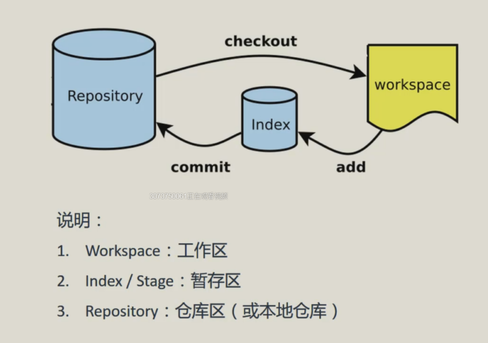
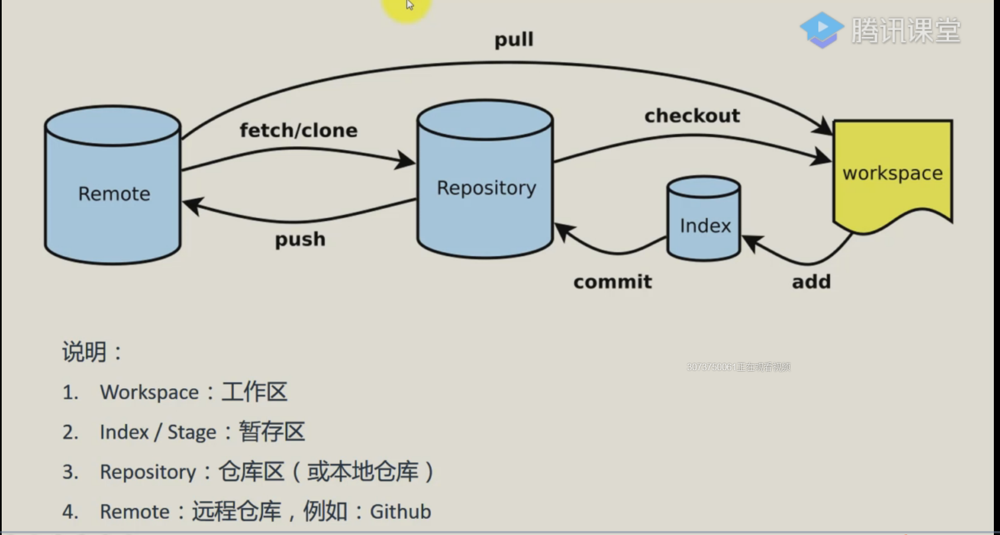
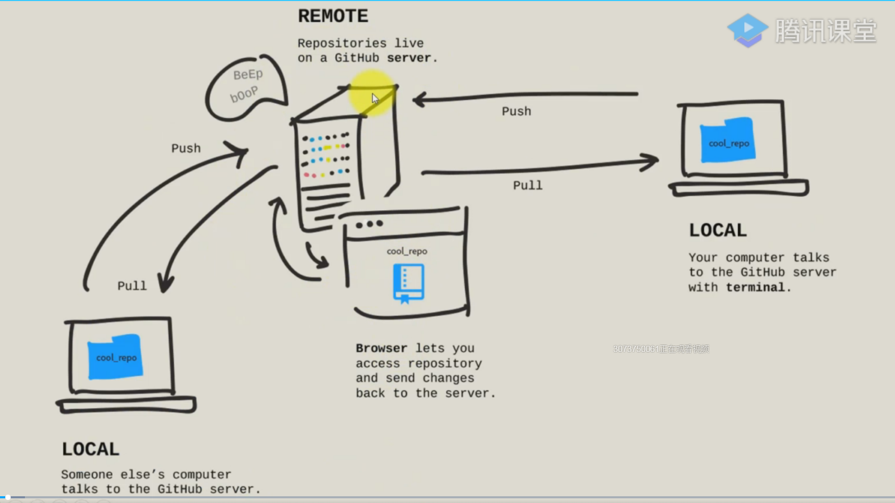
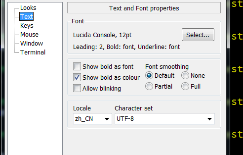

# Git基本命令

## Git 工作原理

- Git本地仓库  

  
仓库的本质就是一个文件夹，一个目录，workspace就相当于一个文件夹

有了暂存区可以控制提交的颗粒度，将来回退的时候不会一下子回到解放前  

可以从暂存区回退到工作区，也可以从仓库回退到工作区

- Git本地仓库与远程仓库  
  


## Git Bash 一些简单操作

**Git Bash命令是git能发挥强大功能的最佳方式**
- Git Bash 命令行设置 字符编码、字体等等  


- Git Bash 快捷键  
```
	shift + insert #粘贴
	
	ctrl + c #命令行终结
	
	ctrl + l #清屏
	
	echo \ (下一行：\)  #继续上面输入，视为一行
	
	cd #进入目录
	
	mkdir #创建文件夹
	
	pwd  #打印目录
	
	mv b.txt ../b.txt  #移动
	
	rm c.txt  #删除 -rf 强制
	
	cp a.txt b.txt  #复制
	
	cat  #打印文本内容
	
```

## Git 基本命令

- 主目录下有git配置信息，叫`.gitconfig`

```
	git config --list #显示git当前配置
	
	git config --global user.name "小明" #设置提交仓库时的用户信息	
	
	git config --global user.email "123456@qq.com" #设置提交仓库时的邮箱信息
	
	git init #在当前目录新建一个代码库
	
	git clone #下载一个项目和它的整个代码历史
	
	git add [file1] [file2] #添加指定文件到暂存区
	
	git rm [file1] [file2] #删除工作区文件，并且将这次删除放入暂存区
	
	git mv [file-origin] [file-renamed] #改名文件，并且将整个改名放入暂存区
	
	git commit -m [message] #提交暂存区到仓库
	
	git commit -a -m [message] #直接从工作区提交到仓库 前提该文件已经有仓库中的历史版本
	
	git status #查看变更信息
	
	git log --oneline #显示当前分支的历史版本
	
	git show 提交哈希值 #查看其中一次提交的详细信息
	
	git remote add [shortname] [url] #增加远程仓库，并命名
	
	git remote -v #查看和远程仓库建立的连接
	
	git push [remote] [branch] #将本地提交推送到远程仓库(远程主机名 远程分支名)
	
	git pull [remote] [branch] #将远程仓库的提交拉到本地(远程主机名 远程分支名)
	
	git checkout -b [branch] #创建分支
	
```
<!--文档注释  -->

